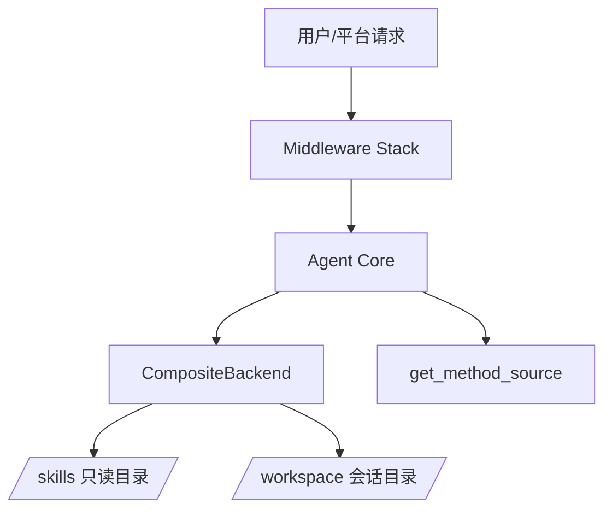
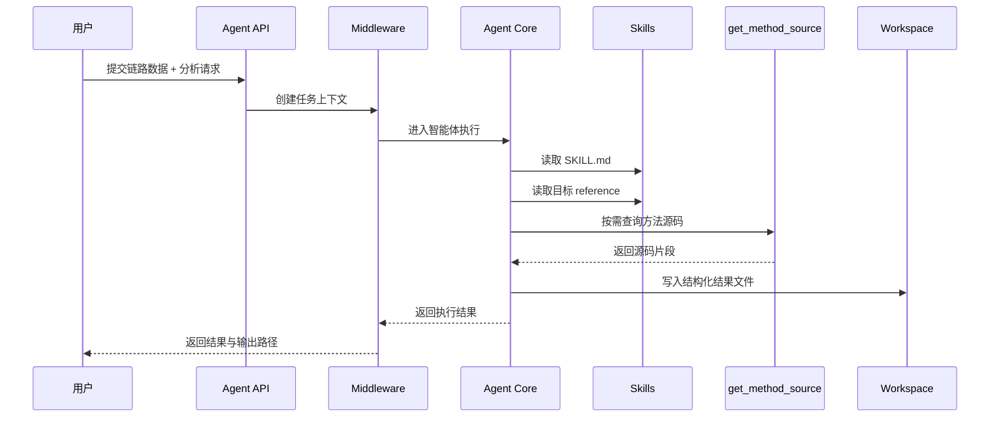

# 接口测试智能体需求设计文档

## 1. 文档信息

- 文档名称：接口测试智能体需求设计文档
- 文档版本：V1.0
- 编写日期：2026-04-05
- 适用阶段：产品立项、技术设计、开发排期、测试验收
- 参考来源：公众号文章《接口测试智能体：6 层中间件 + Skills 系统，打造生产级 AI 接口测试专家》

## 2. 项目背景

现有大模型在接口测试分析场景中存在三个典型问题：

1. 输出结构不稳定，同一类请求在不同轮次中可能生成完全不同的分析格式。
2. 大链路分析容易出现上下文膨胀，导致 token 超限、遗忘前文或推理中断。
3. AI 自由发挥过多，难以沉淀为可复用、可审计、可接入下游平台的稳定能力。

本文档定义一个面向生产环境的“接口测试智能体”系统。系统基于接口链路数据，对外稳定提供四类能力：

1. 业务逻辑梳理
2. Bug/风险分析
3. 测试用例生成
4. API 文档生成

系统核心设计原则如下：

1. 用 Skills 代替自由提示，约束 AI 的执行顺序和输出格式。
2. 用三层分离架构实现职责隔离、权限隔离和运行稳定性。
3. 用中间件栈处理生产级问题，包括重试、观测、上下文治理和异常兜底。
4. 用按需取源码工具替代一次性灌入全量源码，控制上下文成本。

## 3. 建设目标

### 3.1 产品目标

- 为测试、开发和质量团队提供一个可重复使用的接口链路分析智能体。
- 将接口链路分析结果标准化，支持接入测试平台、知识库和文档系统。
- 将复杂接口分析从“专家经验驱动”转变为“系统流程驱动”。

### 3.2 业务目标

- 降低接口分析和测试设计的人力成本。
- 提高复杂链路场景下的风险识别率和测试覆盖率。
- 缩短从链路数据生成测试资产的交付周期。

### 3.3 技术目标

- 支持长链路、多轮分析且不因上下文失控导致任务失败。
- 支持会话级工作空间隔离和只读 Skills 目录隔离。
- 支持输出结果结构化和可校验。
- 支持扩展新 Skill、新分析类型和新工具。

## 4. 范围定义

### 4.1 本期范围

- 接收接口链路数据作为输入。
- 基于 Skills 执行四类分析任务。
- 生成标准化 Markdown 结果文件。
- 支持按需查询方法源码。
- 支持会话隔离、上下文治理、失败重试和日志监控。

### 4.2 非本期范围

- 自动执行接口请求或自动回放流量。
- 自动生成 Mock 服务。
- 自动修复代码缺陷。
- 自动构造完整测试环境数据。
- 通用多模态文档识别。

## 5. 用户角色与使用场景

### 5.1 用户角色

1. 测试工程师：输入接口链路，获取风险分析与测试用例。
2. 开发工程师：核对业务流转与源码行为，补充方法实现细节。
3. 测试负责人：检查测试覆盖度、输出规范性和文档沉淀质量。
4. 平台管理员：维护 Skills、工具和系统配置。

### 5.2 核心场景

#### 场景 A：业务梳理

用户上传某接口从 Controller 到 DAO 的链路数据，请系统输出：

- 业务目标
- 核心处理步骤
- 关键分支判断
- 外部依赖
- Mermaid 业务流程图

#### 场景 B：风险分析

用户要求识别链路中的异常处理、空值、状态流转、幂等性、权限校验等风险，系统输出标准风险清单与影响说明。

#### 场景 C：测试用例生成

用户要求基于链路生成高优先级测试用例，系统输出包含前置条件、步骤、预期结果、优先级、覆盖点的表格化结果。

#### 场景 D：API 文档生成

用户要求基于链路和源码补齐接口文档，系统输出统一结构的接口说明、参数、响应、异常和注意事项。

## 6. 总体设计原则

1. 可预期：同一类任务必须遵守固定 Skill 模板和固定输出结构。
2. 可追溯：每次分析均可定位输入链路、调用工具、输出文件和日志。
3. 可隔离：Skills 只读，工作空间可写，按会话隔离。
4. 可扩展：新增任务类型时，只需补充 Skill 和必要工具，不破坏主流程。
5. 可控：不允许模型在信息不足时编造结论，必须显式标记不确定项。
6. 可运维：具备监控、限流、重试、熔断和上下文治理能力。

## 7. 功能需求

### 7.1 输入管理

系统应支持以下输入：

1. 接口链路 JSON
2. 用户任务指令
3. 可选附加上下文，如业务背景、关注点、已有缺陷记录

输入校验规则：

1. 链路 JSON 必须满足最小字段集要求。
2. 缺失关键字段时，系统必须给出明确错误或降级说明。
3. 输入文件大小和 token 估算必须在接入层完成预校验。

### 7.2 意图识别与 Skill 路由

系统必须支持从用户请求中识别分析意图，并映射到对应 Skill 节点：

- A1：业务逻辑梳理
- A2：Bug 风险分析
- A3：测试用例生成
- A5：API 文档生成

执行规则：

1. 先读取 /skills/SKILL.md。
2. 根据匹配结果读取对应 reference 文件。
3. 严格按 reference 规定的格式输出。
4. 不允许跳过 Skill 读取步骤直接生成内容。

### 7.3 四类核心分析能力

#### A1 业务逻辑梳理

输出要求：

- 接口目标概述
- 端到端流程说明
- 关键条件分支
- 外部依赖与数据流
- Mermaid 流程图
- 未知项与待确认项

#### A2 Bug 风险分析

输出要求：

- 风险编号
- 风险点描述
- 触发条件
- 影响范围
- 风险等级
- 建议验证方式
- 证据来源

#### A3 测试用例生成

输出要求：

- 用例编号
- 用例标题
- 优先级
- 前置条件
- 测试步骤
- 预期结果
- 覆盖风险/分支
- 是否依赖环境或数据构造

#### A5 API 文档生成

输出要求：

- 接口名称与用途
- 请求路径与方法
- 请求参数
- 业务处理逻辑摘要
- 返回结构
- 异常场景
- 调用限制/注意事项
- 依赖服务说明

### 7.4 方法源码按需查询

系统必须提供 get_method_source 工具，用于在分析过程中按类名、方法名拉取源码。

约束要求：

1. 只有在链路数据不足以支持判断时才触发查询。
2. 查询结果应被纳入本轮推理证据，而非长期保留全部源码。
3. 查询失败时必须记录原因，并允许当前任务降级完成。

### 7.5 工作空间与文件管理

系统必须支持会话级输出目录，推荐路径规则：

workspace/agent_files/{agent_type}/{thread_id}/

文件系统要求：

1. /skills/ 虚拟路径映射到只读技能目录。
2. 默认路径映射到工作空间可写目录。
3. 生成结果必须按任务类型落文件。
4. 输出文件名应可预测、可复用、可检索。

建议输出文件：

- logic-analysis.md
- risk-analysis.md
- test-cases.md
- api-doc.md
- execution-log.json
- trace-summary.json

### 7.6 结果结构化与质量约束

系统输出必须满足：

1. 同一 Skill 的章节顺序固定。
2. 同一字段命名固定。
3. 不得生成与输入无关的臆测内容。
4. 所有结论应尽可能给出证据来源或依据。
5. 信息不足时必须输出“待确认”或“无法判断”，禁止伪造完整性。

### 7.7 失败处理与恢复

系统必须支持：

1. 模型调用失败自动重试。
2. 工具调用失败的分类处理。
3. 超长上下文的自动清理与继续执行。
4. 输出写文件失败时的补偿机制。
5. 任务状态机和终态标记。

## 8. 非功能需求

### 8.1 稳定性

- 单次任务成功率目标：>= 95%
- 重试后最终成功率目标：>= 98%
- 非致命工具失败不应直接导致整体任务失败

### 8.2 性能

- 普通链路分析首轮响应时间：<= 10 秒
- 复杂链路完整产出时间：<= 120 秒
- 单会话支持链路数据和上下文累计达到高 token 负载时仍可继续分析

### 8.3 可观测性

- 必须记录任务 ID、会话 ID、Skill 节点、工具调用次数、重试次数、耗时、失败原因
- 必须支持链路级日志查询和聚合指标上报

### 8.4 安全性

- Skills 目录必须只读
- 工作空间隔离，防止跨会话污染
- 源码读取需基于白名单路径
- 日志中默认脱敏敏感参数与令牌

### 8.5 可维护性

- Skills 与业务代码解耦
- 中间件职责单一、可插拔
- 每个 Skill 有单独的回归样例和黄金输出

## 9. 系统架构设计

### 9.1 三层分离架构



#### 第一层：Middleware Stack

职责：

- 统一处理重试、监控、上下文治理、异常兜底、状态跟踪和限流

#### 第二层：Agent Core

职责：

- 理解用户意图
- 读取 Skill
- 触发工具
- 组织推理
- 生成结构化结果

#### 第三层：CompositeBackend

职责：

- 将 /skills/ 路由到只读技能目录
- 将默认路径路由到会话工作空间
- 保证技能与输出资产隔离

### 9.2 中间件栈设计

文章明确强调系统采用 6 层中间件，并重点说明了 ContextEditingMiddleware 的机制。为保证可实施性，本方案将 6 层中间件定义为以下标准栈：

1. RequestContextMiddleware
作用：注入 request_id、thread_id、workspace_id、task_type 等上下文，建立任务边界。

2. ObservabilityMiddleware
作用：记录时延、token 使用、工具调用、失败原因和告警事件。

3. RetryMiddleware
作用：对模型调用失败、瞬时网络故障和可恢复错误进行指数退避重试。

4. GuardrailMiddleware
作用：校验输入完整性、输出结构合法性、敏感信息脱敏和权限边界。

5. ContextEditingMiddleware
作用：在上下文过长时清理历史工具结果，避免 token 超限。
关键策略：
- 触发阈值：100000 token
- 至少清理：20000 token
- 保留最近：5 条工具结果
- 不清理 write_file、edit_file 等关键写入记录

6. ErrorBoundaryMiddleware
作用：对不可恢复异常做统一拦截、降级输出和状态收敛。

### 9.3 Skill 系统设计

建议目录：

```text
skills/
  interface-chain-analyzer/
    SKILL.md
    references/
      A1-logic.md
      A2-bug.md
      A3-cases.md
      A5-doc.md
```

设计要求：

1. SKILL.md 负责意图识别与节点映射。
2. reference 文件负责输出格式、分析维度和约束规则。
3. Skill 文件只读，不允许在运行时被智能体修改。
4. 每个 Skill 必须有示例输入和黄金输出样例。

### 9.4 Agent 执行流程



## 10. 数据设计

### 10.1 链路输入数据最小模型

```json
{
  "interface": {
    "name": "createOrder",
    "path": "/api/order/create",
    "method": "POST"
  },
  "entry": {
    "class_name": "OrderController",
    "method_name": "createOrder"
  },
  "call_chain": [
    {
      "layer": "controller",
      "class_name": "OrderController",
      "method_name": "createOrder",
      "signature": "CreateOrderReq -> ApiResponse<CreateOrderResp>"
    }
  ],
  "dependencies": [],
  "exceptions": [],
  "metadata": {
    "language": "java",
    "repo": "sample-repo",
    "generated_at": "2026-04-05T10:00:00Z"
  }
}
```

### 10.2 任务执行状态模型

建议状态：

- pending
- running
- retrying
- partial_success
- success
- failed

### 10.3 输出元数据模型

```json
{
  "task_id": "task_001",
  "thread_id": "thread_001",
  "skill": "A3",
  "status": "success",
  "artifacts": [
    "test-cases.md"
  ],
  "tool_calls": 3,
  "retried": 1,
  "duration_ms": 18234
}
```

## 11. 接口设计

### 11.1 任务提交接口

`POST /api/agent/tasks`

请求体：

- task_type
- prompt
- chain_data
- workspace_id
- options

返回：

- task_id
- status
- workspace_path

### 11.2 任务查询接口

`GET /api/agent/tasks/{task_id}`

返回：

- 当前状态
- 错误信息
- 产物列表
- 指标摘要

### 11.3 方法源码查询接口

`POST /api/agent/tools/get-method-source`

请求体：

- class_name
- method_name
- file_hint

返回：

- source_code
- file_path
- line_range

## 12. 输出规范

### 12.1 统一规范

1. 使用 Markdown 作为默认输出格式。
2. 所有表格列名固定。
3. 所有结果带“分析依据”或“待确认项”章节。
4. 结果顶部包含任务元信息。

### 12.2 结果质量基线

1. 相同输入的章节结构一致性 >= 95%
2. 测试用例优先级字段覆盖率 = 100%
3. 风险分析必须显式区分“已确认风险”和“待验证风险”
4. API 文档必须区分“确定字段”和“推断字段”

## 13. 验收标准

### 13.1 功能验收

1. 四类 Skill 均可独立触发并成功生成结果文件。
2. get_method_source 可在至少 3 类源码缺失场景中成功补充证据。
3. Skills 与工作空间路径隔离生效。
4. 长链路场景下可触发上下文清理并继续完成任务。

### 13.2 稳定性验收

1. 100 条典型链路回归中，总体成功率 >= 95%
2. 复杂链路场景无大面积 token 超限失败
3. 工具瞬时失败可通过重试恢复

### 13.3 输出质量验收

1. 同类输入输出结构一致
2. 不出现明显臆造字段和无依据结论
3. 能输出明确的未知项和依赖补充项

## 14. 风险与约束

### 14.1 核心风险

1. 上游链路数据质量不足，导致分析价值下降。
2. Skill 定义不充分，会将模型不稳定性重新暴露出来。
3. 方法源码检索不准，会影响证据链质量。
4. 输出格式缺少自动校验，长期会出现漂移。

### 14.2 依赖约束

1. 需要稳定提供接口链路追踪数据。
2. 需要具备方法级源码索引能力。
3. 需要模型服务支持较长上下文和工具调用。
4. 需要日志与监控基础设施。

## 15. 建议技术选型

- Agent 框架：支持工具调用、Skill 管理和 Middleware 的 Agent Runtime
- 后端语言：Java 8
- Web API：Spring Boot 2.7.6
- 构建工具：Maven
- 文件路由：CompositeBackend 模式
- 观测：OpenTelemetry + Prometheus + Grafana
- 持久化：PostgreSQL 或 SQLite 用于任务元数据，文件系统用于产物
- 日志：结构化 JSON 日志

## 16. 里程碑建议

1. M1：单机可运行 PoC，打通 A1/A2/A3/A5 的最小闭环。
2. M2：完成中间件栈、会话隔离、方法源码查询和结果落盘。
3. M3：完成输出校验、监控看板、回归样例库和试点接入。
4. M4：完成生产化加固和团队推广。

## 17. 附录：推荐目录结构

```text
api-test-agent/
  app/
    api/
    agent/
    middleware/
    backends/
    tools/
    services/
    schemas/
  skills/
    interface-chain-analyzer/
      SKILL.md
      references/
  workspace/
    agent_files/
  tests/
    fixtures/
    golden/
    integration/
  docs/
    requirements-design.md
    development-plan.md
```